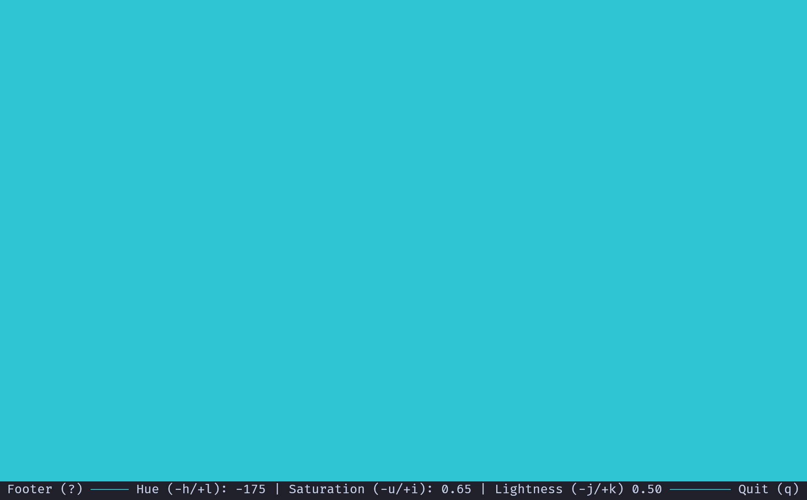

# huetui



```
TUI to fill the screen with a single adjustable color

Usage: huetui [OPTIONS]

Options:
  -f, --no-footer                Hide footer on start
  -u, --hue <HUE>                Initial value for hue. Range (-180,180], automatically wraps [default: 0]
  -s, --saturation <SATURATION>  Initial value for saturation. Range [0.0, 1.0], automatically clamps [default: 0]
  -l, --lightness <LIGHTNESS>    Initial value for lightness. Range [0.0, 1.0], automatically clamps [default: 1]
  -h, --help                     Print help
```
